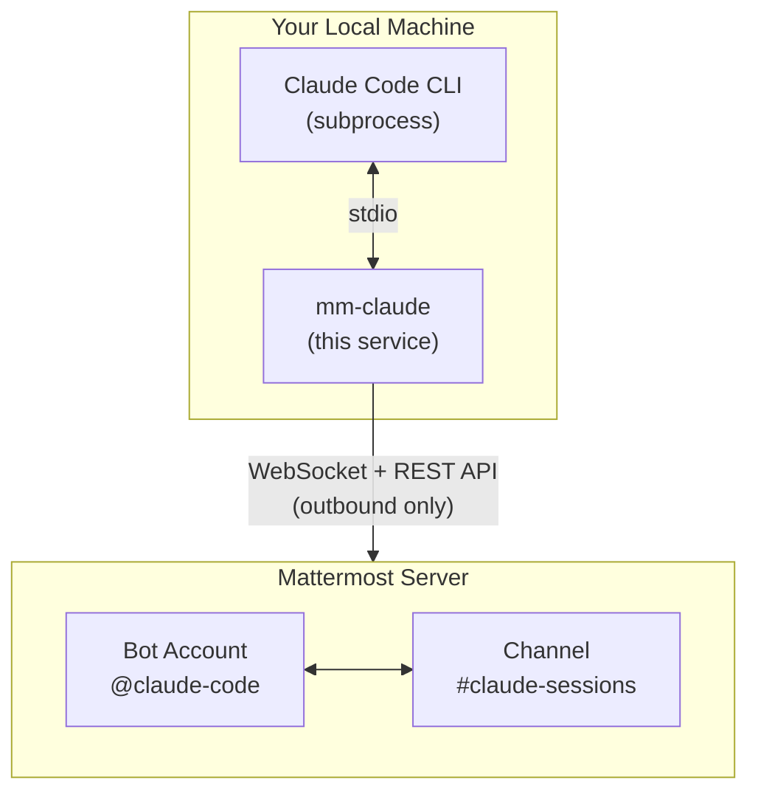

# Mattermost Claude Code Bridge

[](https://www.npmjs.com/package/mattermost-claude-code)
[](https://opensource.org/licenses/MIT)

Share Claude Code sessions live in a Mattermost channel. Your colleagues can watch you work with Claude in real-time, collaborate on sessions, and even trigger their own sessions from Mattermost.

## Features

- **Real-time streaming** - Claude's responses stream live to Mattermost
- **Multiple concurrent sessions** - Each thread gets its own Claude session
- **Session collaboration** - Invite others to participate in your session
- **Interactive permissions** - Approve Claude's actions via emoji reactions
- **Plan approval** - Review and approve Claude's plans before execution
- **Task tracking** - Live todo list updates as Claude works
- **Code diffs** - See exactly what Claude is changing

## How it works



Runs entirely on your machine - only **outbound** connections to Mattermost. No port forwarding needed!

## Prerequisites

1. **Claude Code CLI** installed and authenticated (`claude --version`)
2. **Node.js 18+**
3. **Mattermost bot account** with a personal access token

## Quick Start

### 1. Install

```bash
npm install -g mattermost-claude-code
```

### 2. Run

```bash
cd /your/project
mm-claude
```

On first run, an interactive setup wizard guides you through configuration:

```
Welcome to mm-claude!

No configuration found. Let's set things up.

You'll need:
• A Mattermost bot account with a token
• A channel ID where the bot will listen

? Mattermost URL: https://your-mattermost.com
? Bot token: ********
? Channel ID: abc123def456
? Bot mention name: claude-code
? Allowed usernames: alice,bob
? Skip permission prompts? No

✓ Configuration saved!
  ~/.config/mm-claude/.env

Starting mm-claude...
```

### 3. Use

In Mattermost, mention the bot:

```
@claude-code help me fix the bug in src/auth.ts
```

## CLI Options

```bash
mm-claude [options]

Options:
  --url <url>            Mattermost server URL
  --token <token>        Bot token
  --channel <id>         Channel ID
  --bot-name <name>      Bot mention name (default: claude-code)
  --allowed-users <list> Comma-separated allowed usernames
  --skip-permissions     Skip permission prompts (auto-approve)
  --no-skip-permissions  Enable permission prompts (override env)
  --debug                Enable debug logging
  --version              Show version
  --help                 Show help
```

CLI options override environment variables.

## Session Commands

Type `!help` in any session thread to see available commands:

| Command | Description |
|:--------|:------------|
| `!help` | Show available commands |
| `!invite @user` | Invite a user to this session |
| `!kick @user` | Remove an invited user |
| `!permissions interactive` | Enable interactive permissions |
| `!stop` | Stop this session |

> **Note:** Commands use `!` prefix instead of `/` to avoid conflicts with Mattermost's slash commands.

## Session Collaboration

### Invite Users

Session owners can temporarily allow others to participate:

```
!invite @colleague
```

The colleague can now send messages in this session thread.

### Kick Users

Remove an invited user from the session:

```
!kick @colleague
```

### Message Approval

When an unauthorized user sends a message in a session thread, the owner sees an approval prompt:

```
🔒 @unauthorized-user wants to send a message:
> Can you also add error handling?

React 👍 to allow this message, ✅ to invite them to the session, 👎 to deny
```

### Side Conversations

Messages starting with `@someone-else` are ignored by the bot, allowing side conversations in the thread without triggering Claude.

### Downgrade Permissions

If the bot is running with `--skip-permissions` (auto mode), you can enable interactive permissions for a specific session:

```
!permissions interactive
```

This allows collaboration by requiring approval for Claude's actions. Note: you can only downgrade (auto → interactive), not upgrade - this ensures security.

## Interactive Features

### Permission Approval

When Claude wants to execute a tool (edit file, run command, etc.):

- **👍 Allow** - Approve this specific action
- **✅ Allow all** - Approve all future actions this session
- **👎 Deny** - Reject this action

To skip prompts: `mm-claude --skip-permissions` or set `SKIP_PERMISSIONS=true`

### Plan Mode

When Claude creates a plan and is ready to implement:

- **👍** Approve and start building
- **👎** Request changes

Once approved, subsequent plans auto-continue.

### Questions

When Claude asks questions with multiple choice options:

- React with 1️⃣ 2️⃣ 3️⃣ or 4️⃣ to answer
- Questions are asked one at a time

### Task List

Claude's todo list shows live in Mattermost:

- ⬜ Pending
- 🔄 In progress
- ✅ Completed

### Session Header

The session start message shows current status and updates when participants change:

```
🤖 mm-claude v0.5.1

| | |
|:--|:--|
| 📂 Directory | ~/project |
| 👤 Started by | @alice |
| 👥 Participants | @bob, @carol |
| 🔢 Session | #1 of 5 max |
| 🔐 Permissions | Interactive |
```

### Cancel Session

Stop a running session:

- Type `!stop` or `!cancel` in the thread
- React with ❌ or 🛑 to any message in the thread

## Access Control

Set `ALLOWED_USERS` to restrict who can use the bot:

```env
ALLOWED_USERS=alice,bob,carol
```

- Only listed users can start sessions
- Only listed users can approve permissions
- Session owners can `!invite` others temporarily
- Empty = anyone can use (be careful!)

## Environment Variables

| Variable | Description |
|----------|-------------|
| `MATTERMOST_URL` | Server URL |
| `MATTERMOST_TOKEN` | Bot token |
| `MATTERMOST_CHANNEL_ID` | Channel to listen in |
| `MATTERMOST_BOT_NAME` | Mention name (default: `claude-code`) |
| `ALLOWED_USERS` | Comma-separated usernames |
| `SKIP_PERMISSIONS` | `true` to auto-approve actions |
| `MAX_SESSIONS` | Max concurrent sessions (default: `5`) |
| `SESSION_TIMEOUT_MS` | Idle timeout in ms (default: `1800000` = 30 min) |

Config file locations (in priority order):
1. `./.env` (current directory)
2. `~/.config/mm-claude/.env`
3. `~/.mm-claude.env`

## Code Display

- **Edit**: Shows diff with `-` removed and `+` added lines
- **Write**: Shows preview of new file content
- **Bash**: Shows command being executed
- **Read**: Shows file path being read
- **MCP tools**: Shows tool name and server

## For Mattermost Admins

To set up a bot account:

1. Go to **Integrations > Bot Accounts > Add Bot Account**
2. Give it a username (e.g., `claude-code`) and display name
3. Create a **Personal Access Token** for the bot
4. Add the bot to the channel where it should listen

The bot needs permissions to:
- Post messages
- Add reactions
- Read channel messages

## License

MIT
