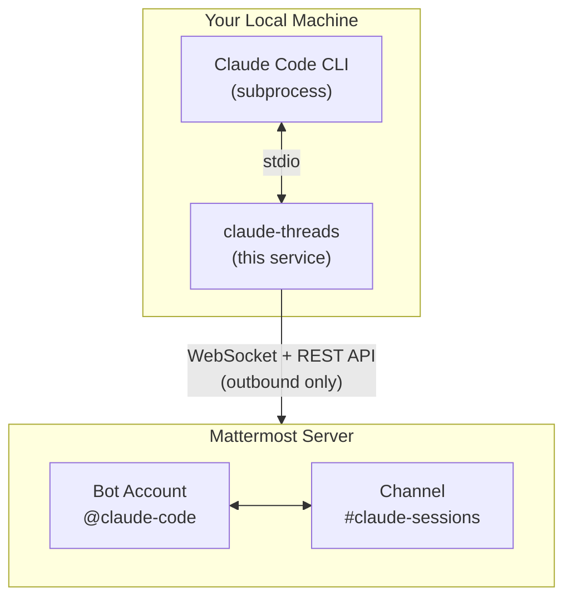

# Claude Threads

```
 ✴ ▄█▀ ███ ✴   claude-threads
✴  █▀   █   ✴  Mattermost × Claude Code
 ✴ ▀█▄  █  ✴
```

[](https://www.npmjs.com/package/claude-threads)
[](https://www.npmjs.com/package/claude-threads)
[](https://opensource.org/licenses/Apache-2.0)
[](https://bun.sh/)
[](https://www.typescriptlang.org/)
[](CONTRIBUTING.md)

**Bring Claude Code to your team.** Run Claude Code on your machine, share it live in Mattermost. Colleagues can watch, collaborate, and run their own sessions—all from chat.

> 💡 *Think of it as screen-sharing for AI pair programming, but everyone can type.*

## Features

- **Real-time streaming** - Claude's responses stream live to Mattermost
- **Multiple concurrent sessions** - Each thread gets its own Claude session
- **Session persistence** - Sessions survive bot restarts and resume automatically
- **Session collaboration** - Invite others to participate in your session
- **Interactive permissions** - Approve Claude's actions via emoji reactions
- **Plan approval** - Review and approve Claude's plans before execution
- **Task tracking** - Live todo list updates as Claude works (collapsible)
- **Code diffs** - See exactly what Claude is changing
- **Image attachments** - Attach images for Claude to analyze
- **Thread context** - Start mid-thread and include previous messages as context
- **Git worktrees** - Isolate changes in separate branches/directories
- **Chrome automation** - Control Chrome browser for web tasks
- **Keep-alive** - Prevents system sleep while sessions are active

## How it works



Runs entirely on your machine - only **outbound** connections to Mattermost. No port forwarding needed!

## Prerequisites

1. **Claude Code CLI** installed and authenticated (`claude --version`)
2. **Bun 1.2.21+** (`bun --version`) - [Install Bun](https://bun.sh/)
3. **Mattermost bot account** with a personal access token

## Quick Start

### 1. Install

```bash
bun install -g claude-threads
```

### 2. Run

```bash
cd /your/project
claude-threads
```

On first run, an interactive setup wizard guides you through configuration:

```
  claude-threads setup
  ─────────────────────────────────

  Welcome! Let's configure claude-threads.

? Default working directory: /home/user/projects
? Enable Chrome integration? No
? Git worktree mode: Prompt

  Now let's add your platform connections.

? First platform: Mattermost
? Platform ID: default
? Display name: Mattermost

  Mattermost setup:

? Server URL: https://chat.example.com
? Bot token: ********
? Channel ID: abc123def456
? Bot mention name: claude-code
? Allowed usernames (optional): alice,bob
? Auto-approve all actions? No

  ✓ Added Mattermost

? Add another platform? No

  ✓ Configuration saved!
    ~/.config/claude-threads/config.yaml

  Configured 1 platform(s):
    • Mattermost (mattermost)

  Starting claude-threads...
```

### 3. Use

In Mattermost, mention the bot:

```
@claude-code help me fix the bug in src/auth.ts
```

## CLI Options

```bash
claude-threads [options]

Options:
  --url <url>              Mattermost server URL
  --token <token>          Bot token
  --channel <id>           Channel ID
  --bot-name <name>        Bot mention name (default: claude-code)
  --allowed-users <list>   Comma-separated allowed usernames
  --skip-permissions       Skip permission prompts (auto-approve)
  --no-skip-permissions    Enable permission prompts (override env)
  --chrome                 Enable Chrome integration
  --no-chrome              Disable Chrome integration
  --worktree-mode <mode>   Git worktree mode: off, prompt, require
  --setup                  Re-run setup wizard (reconfigure settings)
  --debug                  Enable debug logging
  --version                Show version
  --help                   Show help
```

CLI options override environment variables.

## Session Commands

Type `!help` in any session thread to see available commands:

| Command | Description |
|:--------|:------------|
| `!help` | Show available commands |
| `!release-notes` | Show release notes for current version |
| `!context` | Show context usage (accurate % from Claude's status line) |
| `!cost` | Show token usage and cost for this session |
| `!compact` | Compress context to free up space |
| `!cd <path>` | Change working directory (restarts Claude) |
| `!worktree <branch>` | Create and switch to a git worktree |
| `!invite @user` | Invite a user to this session |
| `!kick @user` | Remove an invited user |
| `!permissions interactive` | Enable interactive permissions |
| `!escape` | Interrupt current task (keeps session active) |
| `!stop` | Stop this session |
| `!kill` | Emergency shutdown (kills ALL sessions, exits bot) |

> **Note:** Commands use `!` prefix instead of `/` to avoid conflicts with Mattermost's slash commands.

## Session Collaboration

### Invite Users

Session owners can temporarily allow others to participate:

```
!invite @colleague
```

The colleague can now send messages in this session thread. The bot validates that the user exists before inviting.

### Kick Users

Remove an invited user from the session:

```
!kick @colleague
```

The bot validates that the user exists before attempting to kick them.

### Message Approval

When an unauthorized user sends a message in a session thread, the owner sees an approval prompt:

```
🔒 @unauthorized-user wants to send a message:
> Can you also add error handling?

React 👍 to allow this message, ✅ to invite them to the session, 👎 to deny
```

### Side Conversations

Messages starting with `@someone-else` are ignored by the bot, allowing side conversations in the thread without triggering Claude.

### Downgrade Permissions

If the bot is running with `--skip-permissions` (auto mode), you can enable interactive permissions for a specific session:

```
!permissions interactive
```

This allows collaboration by requiring approval for Claude's actions. Note: you can only downgrade (auto → interactive), not upgrade - this ensures security.

## Git Worktrees

When working on a task that requires code changes, Claude can work in an isolated git worktree. This keeps your main branch clean while Claude works on a feature branch in a separate directory.

### Starting a Session with a Worktree

Specify a branch when starting:

```
@claude-code on branch feature/add-auth implement user authentication
```

Or use the worktree command:

```
@claude-code !worktree feature/add-auth implement user authentication
```

### Worktree Commands

| Command | Description |
|:--------|:------------|
| `!worktree <branch>` | Create worktree and switch to it |
| `!worktree list` | List all worktrees for this repo |
| `!worktree switch <branch>` | Switch to an existing worktree |
| `!worktree remove <branch>` | Remove a worktree |
| `!worktree off` | Disable worktree prompts for this session |

### How It Works

1. Creates a new worktree at `../<repo>-worktrees/<branch>/`
2. Creates or checks out the specified branch
3. Claude works in the worktree directory
4. Your main working directory stays untouched

### Environment Variable

| Variable | Description |
|----------|-------------|
| `WORKTREE_MODE` | `prompt` (ask on new sessions), `require` (always require branch), `off` (disable) |

## Interactive Features

### Permission Approval

When Claude wants to execute a tool (edit file, run command, etc.):

- **👍 Allow** - Approve this specific action
- **✅ Allow all** - Approve all future actions this session
- **👎 Deny** - Reject this action

To skip prompts: `claude-threads --skip-permissions` or set `SKIP_PERMISSIONS=true`

### Plan Mode

When Claude creates a plan and is ready to implement:

- **👍** Approve and start building
- **👎** Request changes

Once approved, subsequent plans auto-continue.

### Questions

When Claude asks questions with multiple choice options:

- React with 1️⃣ 2️⃣ 3️⃣ or 4️⃣ to answer
- Questions are asked one at a time

### Task List

Claude's todo list shows live in Mattermost and stays at the bottom of the thread:

- ○ Pending
- 🔄 In progress (shows elapsed time)
- ✅ Completed

React with 🔽 to collapse/expand the task list. Progress shown as `(2/5 · 40%)`.

### Channel Dashboard

A pinned message at the bottom of the channel shows active sessions and recent history with system status, pending prompts, and current tasks. Session history is retained for up to 3 days.

### Session Header

Each session shows a real-time status bar with context usage (color-coded 🟢🟡🟠🔴), model name, cost, and uptime. The header table displays topic, directory, git branch, participants, and PR link (when working in a worktree with an associated pull request).

### Cancel Session

Stop a running session:

- Type `!stop` or `!cancel` in the thread
- React with ❌ or 🛑 to any message in the thread

### Session Persistence

Sessions automatically survive bot restarts:

- Active sessions are saved to `~/.config/claude-threads/sessions.json`
- On restart, sessions resume with full context via Claude's `--resume` flag
- Users see "Session resumed after bot restart" notification
- Timed-out sessions can be resumed by reacting with 🔄 or sending a new message

### Image Attachments

Attach images (JPEG, PNG, GIF, WebP) to your messages and Claude will analyze them. Works for both new sessions and follow-up messages.

### Thread Context

When starting a session mid-thread (replying to existing conversation), you'll be prompted to include previous messages as context. Options include last 3, 5, 10, or all messages. Single-message threads auto-include context.

## Chrome Integration

Enable browser automation with `--chrome` or `chrome: true` in config:

```bash
claude-threads --chrome
```

Claude can then control your Chrome browser for web tasks like:
- Taking screenshots and analyzing pages
- Filling forms and clicking buttons
- Navigating and extracting content

Requires the [Claude in Chrome](https://chromewebstore.google.com/detail/claude-in-chrome/) extension.

## Access Control

Set `allowedUsers` in your platform config to restrict who can use the bot:

```yaml
platforms:
  - id: mattermost-main
    # ...
    allowedUsers: [alice, bob, carol]
```

- Only listed users can start sessions
- Only listed users can approve permissions
- Session owners can `!invite` others temporarily
- Empty = anyone can use (be careful!)

## Configuration

Configuration is stored in YAML format at `~/.config/claude-threads/config.yaml`.

### Example Config

```yaml
version: 1
workingDir: /home/user/repos/myproject
chrome: false
worktreeMode: prompt

platforms:
  - id: mattermost-main
    type: mattermost
    displayName: Main Team
    url: https://chat.example.com
    token: your-bot-token
    channelId: abc123
    botName: claude-code
    allowedUsers: [alice, bob]
    skipPermissions: false
```

### Global Settings

| Setting | Description |
|---------|-------------|
| `workingDir` | Default working directory for Claude |
| `chrome` | Enable Chrome integration (`true`/`false`) |
| `worktreeMode` | Git worktree mode: `off`, `prompt`, or `require` |

### Platform Settings (Mattermost)

| Setting | Description |
|---------|-------------|
| `url` | Mattermost server URL |
| `token` | Bot access token |
| `channelId` | Channel to listen in |
| `botName` | Mention name (default: `claude-code`) |
| `allowedUsers` | List of usernames who can use the bot |
| `skipPermissions` | Auto-approve actions (`true`/`false`) |

### Environment Variables

| Variable | Description |
|----------|-------------|
| `MAX_SESSIONS` | Max concurrent sessions (default: `5`) |
| `SESSION_TIMEOUT_MS` | Idle timeout in ms (default: `1800000` = 30 min) |
| `NO_UPDATE_NOTIFIER` | Set to `1` to disable update checks |
| `DEBUG` | Set to `1` for verbose logging |

### Keep-Alive

The bot automatically prevents system sleep while sessions are active (uses `caffeinate` on macOS, `systemd-inhibit` on Linux). Disable with `--no-keep-alive` or `keepAlive: false` in config.

## Code Display

- **Edit**: Shows diff with `-` removed and `+` added lines
- **Write**: Shows preview of new file content
- **Bash**: Shows command being executed
- **Read**: Shows file path being read
- **MCP tools**: Shows tool name and server

## Auto-Updates

claude-threads checks for updates every 30 minutes and notifies you when a new version is available:

- **CLI**: Shows a notification box on startup
- **Mattermost**: Shows a warning in session headers

To update:

```bash
bun install -g claude-threads
```

To disable update checks, set `NO_UPDATE_NOTIFIER=1`.

## For Mattermost Admins

To set up a bot account:

1. Go to **Integrations > Bot Accounts > Add Bot Account**
2. Give it a username (e.g., `claude-code`) and display name
3. Create a **Personal Access Token** for the bot
4. Add the bot to the channel where it should listen

The bot needs permissions to:
- Post messages
- Add reactions
- Read channel messages

## License

Apache-2.0
